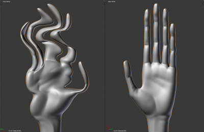
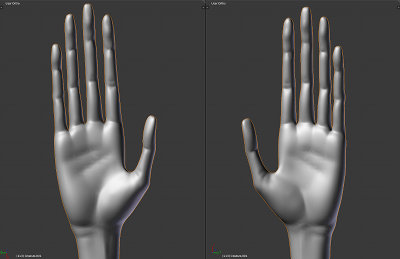
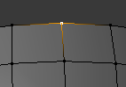
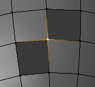
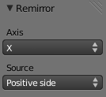

# Remirror

Before                       | After
---------------------------- | --------------------------
 | 

Remirror is a Blender 2.6 plugin that reestablishes symmetry in a mirrored mesh. Symmetry could be lost when, for example, during a mirrored sculpting session, the user hides parts of the mesh that are symmetrical to the parts being sculpted.

Remirror is non-destructive, so UV coordinates, etc. are not changed, and the result can be used with the Multires modifier's _Reshape_ function.

It works by following symmetrical edge paths from the central edge loop(s) of a mesh and updating the coordinates of vertices along the way. Therefore, as long as the mesh topology has not changed, any deformation can be corrected.

## Preconditions

* The mesh must have continuous normals. In other words, normals on a continous surface are all pointing "out" or "in."
* The central edge loop(s) must be (mostly) centered at 0 on the mirror axis.
* A vertex cannot have more than one gap in the faces surrounding it. More precisely, a vertex cannot have more than two edges connected to it that are only connected to one face. (This could probably be fixed.) See below:

This is OK                     | This won't work
------------------------------ | -----------------------------------
 | 

## Options

* _Axis_: The axis along which the object was originally mirrored. (Default: _X_)
* _Source_: The half of the mesh that will be used to update the other half. (Default: _Positive side_)

## Usage with Multires

1. Duplicate the Multires object. (<kbd>Shift</kbd>+<kbd>D</kbd>)
2. With the duplicate selected, make sure the Multires _Preview_ field is set to the desired resolution, then click _Apply_.
3. Apply Remirror to the duplicate. (_Object_ > _Mirror_ > _Remirror_)
4. Select the duplicate, (_right mouse button_)
5. Then select the original. (<kbd>Shift</kbd> + _right mouse button_)
6. Click _Reshape_ on the Multires modifier panel.

## Known Issues

* The algorithm that finds the central edge loop(s) could be improved.
* Error messages aren't shown after adjusting the options.
* Disconnected parts of the mesh that do not intersect the plane dividing the chosen axis are not affected.
